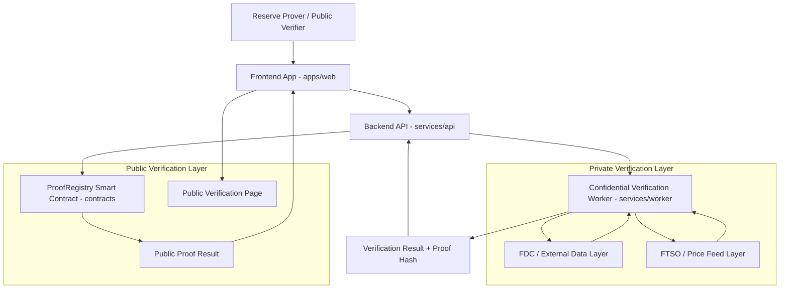

# ProofVault Architecture

## Overview

ProofVault is a confidential cross-chain proof-of-reserves platform built for Flare. It helps crypto organizations prove reserve health across BTC, XRP, DOGE, FLR, stablecoins, and FAssets without exposing sensitive treasury data.

The system is organized as a monorepo:

- `apps/web`: frontend application
- `services/api`: backend API
- `services/worker`: confidential verification simulator
- `contracts`: ProofRegistry smart contract
- `docs`: documentation

At a high level, users interact with the frontend, the backend coordinates proof requests, the worker simulates private reserve verification, external data and price feed layers represent future Flare-powered integrations, and the ProofRegistry smart contract stores only the final public proof result.

## High-Level Architecture Diagram



## System Flow

The architecture follows this flow:

```text
Reserve Prover / Public Verifier
-> Frontend App
-> Backend API
-> Confidential Verification Worker
-> FDC / External Data Layer
-> FTSO / Price Feed Layer
-> Verification Result + Proof Hash
-> Backend API
-> ProofRegistry Smart Contract
-> Public Proof Result
-> Public Verification Page
```

## Component Responsibilities

### Frontend App

The frontend application in `apps/web` is responsible for the landing page, role selection, company dashboard, proof creation flow, reserve wallet input, verification progress, proof result screen, and public verifier page.

### Backend API

The backend API in `services/api` is responsible for creating proof requests, storing proof metadata, sending verification jobs to the worker, receiving proof results, and submitting public proof results to the smart contract.

### Confidential Verification Worker

The confidential verification worker in `services/worker` is responsible for simulating private reserve verification in the MVP. It validates reserve sources, calculates reserve value, compares it to the threshold, generates a proof hash, and returns a pass/fail result.

### FDC / External Data Layer

The FDC / External Data Layer represents the future full-version integration for validating external blockchain data and cross-chain reserve evidence.

### FTSO / Price Feed Layer

The FTSO / Price Feed Layer represents the future full-version integration for asset price feeds and reserve valuation.

### ProofRegistry Smart Contract

The ProofRegistry smart contract in `contracts` stores only the public proof result.

### Public Verification Page

The public verification page allows anyone to view the project's public reserve proof status.

## Hackathon MVP Architecture

For the hackathon MVP:

- FDC is mocked or documented as an intended data layer.
- FTSO / price feeds are mocked with static values.
- Confidential compute is simulated by `services/worker`.
- ProofRegistry stores the final public proof result.
- Public verifier page displays the proof result.

## Full Post-Hackathon Architecture

For the full post-hackathon version:

- FDC is used for real external data attestations.
- FTSO / price feeds are used for live valuation.
- The worker evolves into a confidential compute / TEE-style verifier.
- ProofRegistry becomes the public verification anchor.
